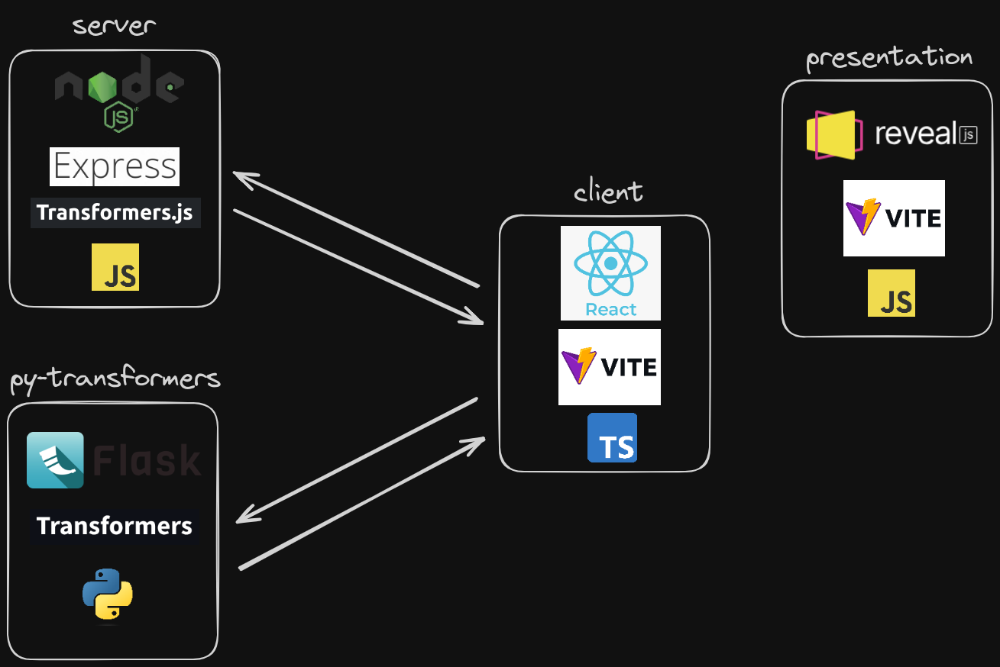

# DevFest GDG Santiago 2023

## 🚀 Descripción del proyecto

Este es el código usado para el workshop "IA en JavaScript sin APIs de terceros" del #DevFest2023 organizado por GDG Santiago en 2023.

El proyecto está dividido en 4 partes:
* `server`: [Node.js](https://nodejs.org/en)/[Express](https://expressjs.com/es/) API.
* `py-transformers`: [Flask](https://flask.palletsprojects.com/en/3.0.x/) API.
* `client`: Aplicación web [React](https://es.react.dev/) para interactuar con las APIs.
* `presentation`: Presentación para mostrar en el workshop hecha con [reveal.js](https://revealjs.com/).



## 🛠️ Instalación

Instalar dependencias de cada parte del proyecto:

### Server

Desde la raiz del proyecto:

```bash
npm install
```

Copiamos el archivo `.env.dist` a `.env` y configuramos las variables de entorno.

```bash
cp .env.dist .env
```

### Client

Desde la carpeta `client`:

```bash
npm install
```

### Presentation

Desde la carpeta `presentation`:

```bash
npm install
```

### Py-transformers

(Requiere Python 3 y para poder usar la gpu, los drivers de CUDA apropiados para la tarjeta gráfica)

Desde la carpeta `py-transformers`:

Creamos un entorno virtual:

```bash
python3 -m venv .venv
```

Activamos el entorno virtual:

```bash
source .venv/bin/activate
```

Instalamos las dependencias:

```bash
pip3 install soundfile transformers datasets sentencepiece torch flask flask-cors
```

o

```bash
pip3 install -r requirements.txt
```


## 🚀 Ejecución

En `./package.json` hay scripts para ejecutar cada parte del proyecto o todas a la vez:

### Ejecutar solo el servidor Express:

```bash
npm run dev:server
```

### Ejecutar solo el cliente React:

```bash
npm run dev:client
```

### Ejecutar solo la presentación:

```bash
npm run dev:presentation
```

### Ejecutar solo la API Flask:

```bash
npm run dev:flask
```

### Ejecutar todas las partes del proyecto:

```bash
npm run dev:all
```
