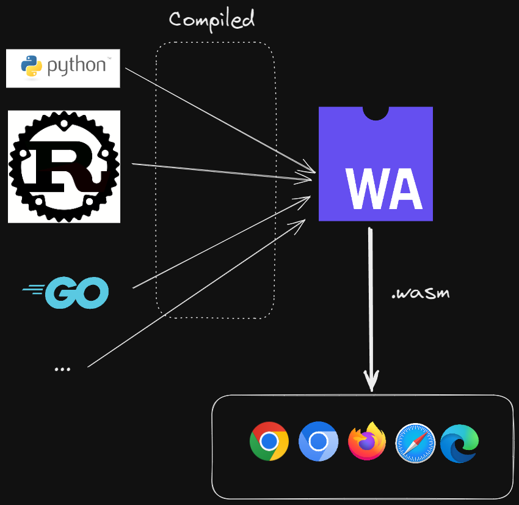

# IA en JavaScript sin APIs de terceros


## Soy David Puente


#### Desarrollador en Dinahosting
* <a href="https://github.com/dpuentel" target="_blank" noopener noreferrer>
	<svg class='w-10 h-10 fill-current' viewBox='0 0 24 24' height="40px" width="40px"><path d='M12 0c-6.626 0-12 5.373-12 12 0 5.302 3.438 9.8 8.207 11.387.599.111.793-.261.793-.577v-2.234c-3.338.726-4.033-1.416-4.033-1.416-.546-1.387-1.333-1.756-1.333-1.756-1.089-.745.083-.729.083-.729 1.205.084 1.839 1.237 1.839 1.237 1.07 1.834 2.807 1.304 3.492.997.107-.775.418-1.305.762-1.604-2.665-.305-5.467-1.334-5.467-5.931 0-1.311.469-2.381 1.236-3.221-.124-.303-.535-1.524.117-3.176 0 0 1.008-.322 3.301 1.23.957-.266 1.983-.399 3.003-.404 1.02.005 2.047.138 3.006.404 2.291-1.552 3.297-1.23 3.297-1.23.653 1.653.242 2.874.118 3.176.77.84 1.235 1.911 1.235 3.221 0 4.609-2.807 5.624-5.479 5.921.43.372.823 1.102.823 2.222v3.293c0 .319.192.694.801.576 4.765-1.589 8.199-6.086 8.199-11.386 0-6.627-5.373-12-12-12z'></path></svg>
	github.com/dpuentel
</a>
* <a href="https://www.linkedin.com/in/david-puente/"  target="_blank" noopener noreferrer>
	<svg class='w-10 h-10 fill-current' width='40' height='40' viewBox='0 0 455 455'><path d='M246.4 204.35v-.665c-.136.223-.324.446-.442.665h.442z' style='fill-rule:evenodd;clip-rule:evenodd'></path><path d='M0 0v455h455V0H0zm141.522 378.002H74.016V174.906h67.506v203.096zm-33.753-230.816h-.446C84.678 147.186 70 131.585 70 112.085c0-19.928 15.107-35.087 38.211-35.087 23.109 0 37.31 15.159 37.752 35.087 0 19.5-14.643 35.101-38.194 35.101zM385 378.002h-67.524V269.345c0-27.291-9.756-45.92-34.195-45.92-18.664 0-29.755 12.543-34.641 24.693-1.776 4.34-2.24 10.373-2.24 16.459v113.426h-67.537s.905-184.043 0-203.096H246.4v28.779c8.973-13.807 24.986-33.547 60.856-33.547 44.437 0 77.744 29.02 77.744 91.398v116.465z' style='fill-rule:evenodd;clip-rule:evenodd'></path></svg>
	linkedin.com/in/david-puente
</a>


### Tal vez me recuerden de peliculas como...


## Introducción

En este taller vamos a ver cómo podemos usar modelos de IA en JavaScript sin necesidad de usar APIs de terceros y manteniendo el control de nuestros datos.


Vamos a usar la biblioteca de Xenova, Trasformers.js, que nos permite usar modelos de IA en JavaScript.


## ¿Qué es un modelo de IA?

Un modelo de IA es un programa que ha sido entrenado para resolver un problema.


Por ejemplo, un modelo de IA puede ser capaz de reconocer imágenes de gatos.


Se entrena con ejemplos de imágenes de gatos y de imágenes que no son de gatos.


Una vez entrenado, el modelo puede ser usado para reconocer imágenes de gatos.


## Transformers


Arquitectura para solucionar problemas de NLP (Natural Language Processing) basada en modelos de atención.


### Pueden ser usados para diferentes tareas como:
* Procesamiento de lenguaje natural: Clasificación de texto, traducción, generación de texto, etc.
* Visión por computador (Computer Vision): Clasificación de imágenes, detección de objetos, etc.
* Audio: Reconocimiento de voz, clasificación de audio, etc.
* Multi-modal: Clasificación de imágenes


## Trasformers.js


Biblioteca de JavaScript que nos permite usar modelos Transformers desde javascript.


### ¿Cómo funciona?

[Transformers.js](https://github.com/xenova/transformers.js) está diseñada para funcionar de forma equivalente a la librería [transformers](https://github.com/huggingface/transformers) de Hugging Face.


Lo que en Python sería:

```python
from transformers import pipeline

# Allocate a pipeline for sentiment-analysis
classifier = pipeline('sentiment-analysis')

classifier('We are very happy to show you this 🤗.')
# [{'label': 'POSITIVE', 'score': 0.9997795224189758}]
```


En JavaScript sería:

```js
import { pipeline } from '@xenova/transformers'

// Allocate a pipeline for sentiment-analysis
const classifier = await pipeline('sentiment-analysis')

classifier('We are very happy to show you the 🤗.')
// [{ label: 'POSITIVE', score: 0.9997795224189758 }]
```


### WASM (WebAssembly)


Para poder usar los modelos de IA en JavaScript, Transformers.js usa WebAssembly.




WebAssembly es código binario portable para ejecutar en el navegador.

Se pueden compilar a WebAssembly lenguajes como C, C++, Rust, Python, etc.


<a href="https://slug.vercel.app/s/transformersjs2" target="_blank" noopener noreferer> Un pequeño ejemplo de transformers.js </a>

```js
import { pipeline } from 'https://cdn.jsdelivr.net/npm/@xenova/transformers@2.8.0';

const button = document.querySelector('button')

button.addEventListener('click', async () => {
  const text = document.querySelector('textarea')?.value
  if (!text) return

  const resultEl = document.querySelector('div#result')
  resultEl.innerHTML = 'Procesando...'

  const classifier = await pipeline('sentiment-analysis');
  const res = await classifier(text);

  resultEl.innerHTML = JSON.stringify(res)
})
```
